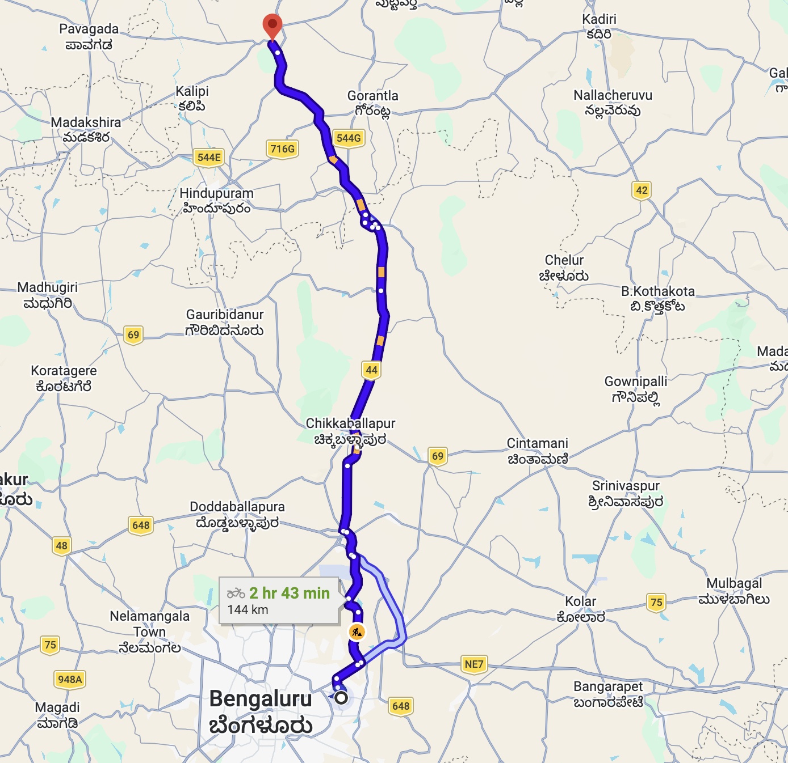
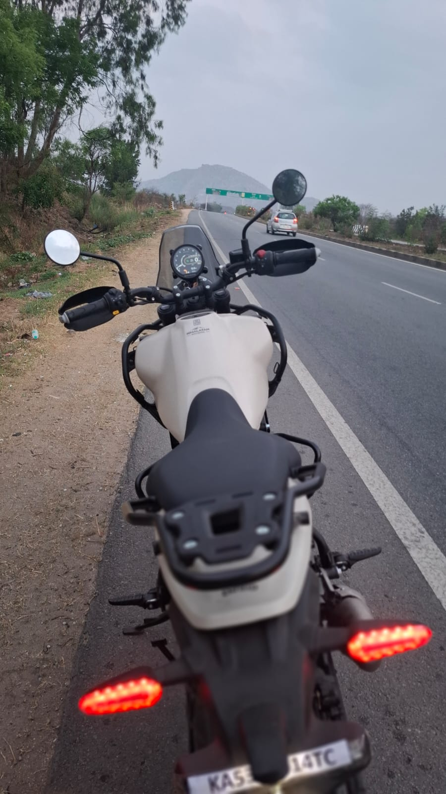
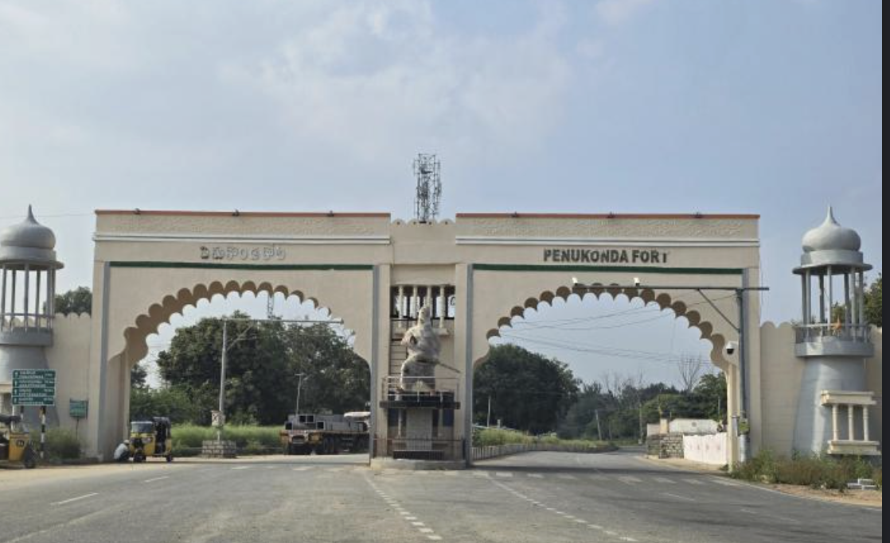

- this was the my first ride on my himalayan 450, yes this is on the break in period, so more curious and more vulnarable this time.
- like many of them said dont go beyond 4krpm some of them said dont go beyond 5k rpm, like the throguh the journey i was very concentrated on these values on the meter.
- ya we geared it up this time a scambler, meteor and my himalayan 450 we started all the way into krpura , then basvanahali then head on to the straight nh44 , ya about straght on the longest national highway of india

- like headed from here all the way to the airport road ya need a break?, yes this time it from tea spot with some tea and then a kick start again,
- ya as i worried dont know should i pump onr or above 100km like bit afraid on that,other are kicking on high all thr way to the roads.my hands also started to say why you not statrting it.man just control it myself iam murmuring to me iteslef,
- ya kepp going gping, like this nh44 is very preetty on the both sides of the roads, like it is very vast and big,on the way sometimes my eyes went on to the far hilltops also.
- our initial plan was get the sunrise , thats i already said, catching 140km all the way within 2hr is task , you know the limit set to 70km my self me,
- some where in the nh , one peace full place iam looking my self with my bike with the long nh is in ahead, and the i just turned on the blinks also, now i can feel the beauty aha. me myself getting satisifiying.

- they are already on far away, i need to catchup them, might be i miss the sunrise,
- the destination is very near to the nh44 , like we just need to diverte only 4km from there, ya throuhg typical andhravillage, with less people, i can see a board with welcome to the peenukinda fort

- 